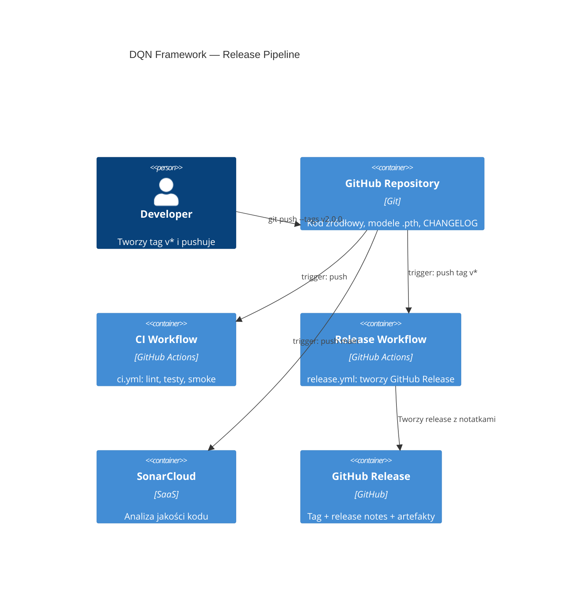

# Release 2.0.0 DQN Framework — Plan Implementacji

## Szczegóły Zadania

| Pole | Wartość |
|---|---|
| Tytuł | Release DQN Framework v2.0.0 |
| Opis | Przygotowanie i opublikowanie pierwszego formalnego GitHub Release dla DQN Framework — wersja 2.0.0. Obejmuje bump wersji, tłumaczenie CHANGELOG na angielski, GitHub Release + git tag oraz workflow automatyzacji release. |
| Priorytet | Wysoki |
| Powiązany Research | [release-2.0.0.research.md](release-2.0.0.research.md) |

## Proponowane Rozwiązanie

Wydanie wersji 2.0.0 realizowane jest jako seria zmian metadanych i CI/CD — bez modyfikacji kodu źródłowego frameworka. Zakres:

1. **Bump wersji** we wszystkich punktach referencyjnych (`version.py`, README badge).
2. **Restrukturyzacja CHANGELOG** — tłumaczenie z polskiego na angielski, scalenie `[1.0.1 - Unreleased]` w `[2.0.0]` z datą release, zachowanie `[1.0.0]` jako wpisu historycznego.
3. **Workflow release** — nowy `.github/workflows/release.yml` wyzwalany tagiem `v*`, tworzący GitHub Release z automatycznie wygenerowanymi notatkami.
4. **Publikacja** — git tag `v2.0.0` → push → workflow tworzy GitHub Release.

```
┌─────────────────────────────────────────────────────┐
│                  Przepływ Release                    │
│                                                     │
│  version.py ──→ "2.0.0"                            │
│  README.md  ──→ badge 2.0.0                         │
│  CHANGELOG  ──→ English, [2.0.0] dated              │
│       │                                             │
│       ▼                                             │
│  git commit ──→ git tag v2.0.0 ──→ git push --tags  │
│       │                                             │
│       ▼                                             │
│  ci.yml (push) ──→ lint + tests + smoke ──→ ✅      │
│       │                                             │
│       ▼                                             │
│  release.yml (tag v*) ──→ GitHub Release created     │
└─────────────────────────────────────────────────────┘
```

## Uzasadnienie Rozwiązania

### Wybrane podejście

Wykorzystanie `softprops/action-gh-release@v2` do automatyzacji tworzenia GitHub Release na bazie tagów SemVer. Podejście minimalistyczne — brak PyPI, brak budowania paczek, brak attachowania dużych artefaktów.

### Porównanie z alternatywami

| Kryterium | softprops/action-gh-release | gh CLI w workflow | actions/create-release |
|---|---|---|---|
| Popularność i wsparcie | ✅ Najpopularniejsza akcja | ⚠️ Wymaga więcej skryptowania | ❌ Zdeprecjonowana |
| Konfiguracja | ✅ Deklaratywna (YAML) | ⚠️ Imperatywna (bash) | ✅ Deklaratywna |
| Markdown body | ✅ Natywne wsparcie | ✅ Przez parametr | ✅ Przez parametr |
| Draft/prerelease | ✅ Wbudowane flagi | ✅ Przez parametr | ❌ Brak |
| Załączanie plików | ✅ Glob pattern | ⚠️ Ręczne | ⚠️ Osobna akcja |

### Dlaczego odrzucono alternatywy
- **gh CLI**: wymaga więcej boilerplate w workflow, mniej czytelne niż deklaratywna konfiguracja akcji.
- **actions/create-release**: zdeprecjonowana przez GitHub, brak aktywnego rozwoju.

## Model C4

### Diagram kontekstowy (Context)

Nie dotyczy — zadanie dotyczy procesu release (CI/CD), nie architektury systemu.

### Diagram kontenerów (Container)



### Diagram komponentów (Component)

Nie dotyczy — zadanie obejmuje pliki konfiguracyjne i metadane, nie komponenty systemu.

## Rejestry Decyzji Architektonicznych (ADR)

### ADR-001: Narzędzie do tworzenia GitHub Release

| Pole | Wartość |
|---|---|
| Status | Zaakceptowany |
| Data | 2026-04-07 |
| Kontekst | Potrzebny workflow tworzący GitHub Release automatycznie po wypchnięciu tagu. Dostępne opcje: `softprops/action-gh-release`, `gh` CLI, zdeprecjonowana `actions/create-release`. |

**Rozważane opcje**:
1. `softprops/action-gh-release@v2` — deklaratywna akcja z natywnym wsparciem dla draft, prerelease, markdown body, glob attachmentów.
2. `gh release create` w kroku workflow — imperatywne, pełna kontrola, ale więcej boilerplate.

**Decyzja**: `softprops/action-gh-release@v2`

**Uzasadnienie**: Najpopularniejsza akcja (~13k stars), deklaratywna konfiguracja, minimalne ryzyko, sprawdzony ekosystem.

**Konsekwencje**:
- ✅ Workflow czytelny i łatwy w utrzymaniu
- ✅ Natywne wsparcie draft release — pozwala na review przed publikacją
- ⚠️ Zależność od akcji third-party (akceptowalne przy popularności i aktywnym utrzymaniu)

### ADR-002: Strategia release notes

| Pole | Wartość |
|---|---|
| Status | Zaakceptowany |
| Data | 2026-04-07 |
| Kontekst | Release notes mogą pochodzić z CHANGELOG (ręcznie utrzymywany) lub być auto-generowane z commitów/PR. |

**Rozważane opcje**:
1. Automatycznie generowane przez GitHub (`generate_release_notes: true`) — szybkie, ale mniej uporządkowane.
2. Ekstrakcja sekcji z CHANGELOG — kuratorowane, ale wymaga skryptu ekstrakcji.
3. Hybrydowe — auto-generowane + link do CHANGELOG.

**Decyzja**: `generate_release_notes: true` z linkiem do CHANGELOG w body

**Uzasadnienie**: Dla pierwszego release auto-generowane notatki obejmą pełny zakres commitów. CHANGELOG dostępny w repozytorium jako szczegółowe źródło kuratorowanych zmian. Brak potrzeby skryptu ekstrakcji na tym etapie.

**Konsekwencje**:
- ✅ Zero dodatkowego kodu/skryptów
- ✅ CHANGELOG zachowuje rolę szczegółowej dokumentacji zmian
- ⚠️ Auto-generowane notatki mogą być mniej czytelne niż kuratorowane (akceptowalne)

## Analiza Aktualnej Implementacji

### Już Zaimplementowane
- CI pipeline — `.github/workflows/ci.yml` — lint + testy + smoke (bez zmian)
- SonarCloud workflow — `.github/workflows/sonar.yml` — analiza jakości (bez zmian)
- Testy jednostkowe — `tests/` — 101 testów, 7 modułów (bez zmian)
- Wszystkie moduły źródłowe — `agents/`, `config/`, `memory/`, `models/`, `utils/` (bez zmian)
- Pre-trained modele — `*.pth` — 7 wytrenowanych modeli (bez zmian)
- Licencja — `LICENSE` — MIT (bez zmian)

### Do Modyfikacji
- `version.py` — zmiana `__version__` z `"1.0.1"` na `"2.0.0"`
- `README.md` — aktualizacja badge wersji z `1.0.1` na `2.0.0`
- `CHANGELOG.md` — tłumaczenie na angielski, scalenie `[1.0.1]` w `[2.0.0]`, ustawienie daty release

### Do Utworzenia
- `.github/workflows/release.yml` — workflow GitHub Actions tworzący GitHub Release przy push tagu `v*`

## Otwarte Pytania

| # | Pytanie | Odpowiedź | Status |
|---|----------|--------|--------|
| 1 | Wersja docelowa? | 2.0.0 (breaking changes: CNN DQN, ALE/Pong-v5, SonarCloud QC) | ✅ Rozwiązane |
| 2 | Kanał release? | GitHub Release + git tag (bez PyPI) | ✅ Rozwiązane |
| 3 | Zakres funkcjonalny? | Wszystkie obecne funkcje = 2.0.0 | ✅ Rozwiązane |
| 4 | Język CHANGELOG? | Angielski — spójny z README | ✅ Rozwiązane |
| 5 | Automatyzacja release? | Tak — workflow na push tagu `v*` | ✅ Rozwiązane |
| 6 | Czy attachować modele .pth do release? | Nie — zostają w repozytorium (duże pliki, dostępne po clone) | ✅ Rozwiązane |

## Plan Implementacji

### Faza 1: Aktualizacja wersji i metadanych

#### Zadanie 1.1 - [MODYFIKUJ] Bump wersji w `version.py`
**Opis**: Zmiana `__version__` z `"1.0.1"` na `"2.0.0"`.

**Definicja Ukończenia (Definition of Done)**:
- [x] `version.py` zawiera `__version__ = "2.0.0"`
- [x] `python -c "from version import __version__; print(__version__)"` wypisuje `2.0.0`

#### Zadanie 1.2 - [MODYFIKUJ] Aktualizacja badge wersji w `README.md`
**Opis**: Zmiana badge `version-1.0.1` na `version-2.0.0` w nagłówku README.

**Definicja Ukończenia (Definition of Done)**:
- [x] Badge w `README.md` wyświetla `version-2.0.0`
- [x] Brak innych odniesień do wersji `1.0.1` w `README.md`

### Faza 2: Restrukturyzacja CHANGELOG

#### Zadanie 2.1 - [MODYFIKUJ] Tłumaczenie i restrukturyzacja `CHANGELOG.md`
**Opis**: Pełne tłumaczenie CHANGELOG z polskiego na angielski. Scalenie sekcji `[1.0.1 - Unreleased]` w `[2.0.0]` z konkretną datą release. Zachowanie `[1.0.0] - 2026-03-14` jako wpisu historycznego (przetłumaczonego). Dodanie pustej sekcji `[Unreleased]` na górze.

Struktura docelowa:
```
# Changelog
(preambuła po angielsku)

## [Unreleased]

## [2.0.0] - YYYY-MM-DD
### Added
(przetłumaczone wpisy z [1.0.1] sekcji "Dodane")

### Fixed
(przetłumaczone wpisy z [1.0.1] sekcji "Naprawione")

### Changed
(przetłumaczone wpisy z [1.0.1] sekcji "Zmienione")

### Removed
(przetłumaczone wpisy z [1.0.1] sekcji "Usunięte")

## [1.0.0] - 2026-03-14
### Added
(przetłumaczone wpisy z [1.0.0] sekcji "Dodane")
```

**Definicja Ukończenia (Definition of Done)**:
- [x] Wszystkie nagłówki sekcji w języku angielskim (`Added`, `Fixed`, `Changed`, `Removed`)
- [x] Preambuła CHANGELOG w języku angielskim
- [x] Sekcja `[2.0.0]` zawiera datę release
- [x] Sekcja `[2.0.0]` zawiera wszystkie wpisy z dawnego `[1.0.1 - Unreleased]` (przetłumaczone)
- [x] Sekcja `[1.0.0] - 2026-03-14` zachowana z przetłumaczonymi wpisami
- [x] Na górze pliku znajduje się pusta sekcja `[Unreleased]`
- [x] Brak polskiego tekstu w pliku
- [x] Format zgodny z [Keep a Changelog 1.1.0](https://keepachangelog.com/en/1.1.0/)

### Faza 3: Workflow Release

#### Zadanie 3.1 - [UTWÓRZ] `.github/workflows/release.yml`
**Opis**: Nowy workflow GitHub Actions wyzwalany przy push tagu pasującego do `v*`. Workflow tworzy GitHub Release z auto-generowanymi notatkami i linkiem do CHANGELOG.

Specyfikacja workflow:
```yaml
name: Release
on:
  push:
    tags: ['v*']
permissions:
  contents: write
jobs:
  release:
    runs-on: ubuntu-latest
    steps:
      - Checkout (actions/checkout@v4)
      - Tworzenie GitHub Release (softprops/action-gh-release@v2)
        - draft: false
        - generate_release_notes: true
        - body: link do CHANGELOG + podsumowanie
```

**Definicja Ukończenia (Definition of Done)**:
- [x] Plik `.github/workflows/release.yml` istnieje
- [x] Workflow trigguje się na push tagów `v*`
- [x] Używa `softprops/action-gh-release@v2`
- [x] Permissions ograniczone do `contents: write`
- [x] `generate_release_notes: true` ustawione
- [x] Body release zawiera link do CHANGELOG w repozytorium
- [x] YAML jest poprawny składniowo (walidacja przez `yamllint` lub GitHub UI)

### Faza 4: Weryfikacja i publikacja

#### Zadanie 4.1 - [UŻYJ PONOWNIE] Weryfikacja CI
**Opis**: Uruchomienie pełnego pipeline CI (lint + unit tests + smoke tests) na commicie z aktualizacjami wersji i CHANGELOG.

**Definicja Ukończenia (Definition of Done)**:
- [x] `pytest tests/ -v` — wszystkie 101 testów przechodzi
- [x] `ruff check . --select E9,F63,F7,F82` — brak błędów
- [x] `python train.py --version` wypisuje `2.0.0`
- [x] `python evaluate.py --version` wypisuje `2.0.0`
- [x] `python play.py --version` wypisuje `2.0.0`

#### Zadanie 4.2 - Weryfikacja spójności wersji
**Opis**: Sprawdzenie, że wszystkie odniesienia do wersji są spójne w całym repozytorium.

**Definicja Ukończenia (Definition of Done)**:
- [x] `version.py` → `"2.0.0"`
- [x] `README.md` badge → `version-2.0.0`
- [x] `CHANGELOG.md` → sekcja `[2.0.0]` z datą
- [x] Brak pozostałości wersji `1.0.1` w repozytorium (grep potwierdza)

#### Zadanie 4.3 - Utworzenie tagu i GitHub Release
**Opis**: Utworzenie tagu `v2.0.0`, wypchnięcie go na GitHub, co wyzwoli workflow `release.yml` i utworzy GitHub Release.

**Definicja Ukończenia (Definition of Done)**:
- [ ] Tag `v2.0.0` istnieje w repozytorium
- [ ] Workflow `release.yml` wyzwolony i zakończony sukcesem
- [ ] GitHub Release `v2.0.0` dostępny publicznie na stronie Releases
- [ ] Release notes zawierają auto-generowane podsumowanie zmian

### Faza 5: Code Review

#### Zadanie 5.1 - Code Review przez agenta `code-reviewer`
**Opis**: Przegląd kodu wykonany przez agenta `code-reviewer` obejmujący wszystkie zmienione i utworzone pliki.

**Definicja Ukończenia (Definition of Done)**:
- [x] Wszystkie uwagi z code review rozwiązane lub zaakceptowane
- [x] Brak krytycznych ani wysokich uwag nierozwiązanych
- [x] Potwierdzenie spójności wersji, poprawności YAML, jakości tłumaczenia CHANGELOG

## Aspekty Bezpieczeństwa

- **Permissions workflow release**: Ograniczone do `contents: write` — minimalne uprawnienia potrzebne do tworzenia release. Brak dostępu do secrets beyond `GITHUB_TOKEN`.
- **Tag protection**: Rekomendowane włączenie ochrony tagów (tag protection rules) w ustawieniach repozytorium, aby zapobiec nieautoryzowanemu tworzeniu tagów `v*` — do konfiguracji poza tym zadaniem.
- **Brak ekspozycji sekretów**: Release notes auto-generowane z commitów — brak ryzyka wycieku kluczy API czy tokenów.
- **Third-party action pinning**: `softprops/action-gh-release@v2` — zalecane przypięcie do konkretnego SHA commitu w przyszłości (poza zakresem pierwszego release).

## Strategia Testowania

### Piramida testów

| Typ testu | Zakres | Szacowana liczba | Pokrycie |
|---|---|---|---|
| Jednostkowe | Istniejące 101 testów — bez zmian | 101 | 51.66% (bez zmian) |
| Smoke testy | CLI `--version` zwraca `2.0.0` | 3 | Weryfikacja wersji |
| CI pipeline | Pełny pipeline ci.yml na commicie | 1 | Regresja |

### Podejście do testowania
- [x] Brak nowych testów jednostkowych — zadanie nie zmienia kodu źródłowego
- [x] Smoke testy `--version` weryfikują spójność bumpu wersji
- [x] CI pipeline weryfikuje brak regresji

### Testy wydajnościowe

Nie dotyczy — zadanie nie zmienia kodu runtime.

### Testy dostępności

Nie dotyczy — brak UI.

### Testy architektoniczne

Nie dotyczy — brak zmian w granicach modułów.

### Testy mutacyjne

Nie dotyczy — brak zmian w logice biznesowej.

## Zapewnienie Jakości

- [x] Wersja `2.0.0` spójna we wszystkich plikach (`version.py`, `README.md`, `CHANGELOG.md`)
- [x] CHANGELOG w pełni przetłumaczony na angielski, zgodny z Keep a Changelog 1.1.0
- [x] Workflow `release.yml` poprawny składniowo i funkcjonalnie
- [x] CI pipeline (ci.yml) przechodzi na commicie release
- [ ] GitHub Release `v2.0.0` dostępny publicznie z notatkami (wymaga pushowania tagu)
- [x] Brak polskiego tekstu w CHANGELOG
- [x] Brak odniesień do wersji `1.0.1` w repozytorium

## Usprawnienia (Poza Zakresem)

- **Tag protection rules** — konfiguracja ochrony tagów `v*` w ustawieniach repozytorium GitHub.
- **Action SHA pinning** — przypięcie `softprops/action-gh-release` do konkretnego SHA commitu zamiast tagu `v2`.
- **CONTRIBUTING.md, CODE_OF_CONDUCT.md, SECURITY.md** — pliki community health do dodania w przyszłych wersjach.
- **PyPI packaging** — rozszerzenie `pyproject.toml` o `[project]` i `[build-system]` umożliwiające `pip install`.
- **Automatyczny changelog extraction** — skrypt wyodrębniający sekcję CHANGELOG dla danej wersji i wstawiający jako body release.
- **Pre-release workflow** — wsparcie dla tagów `v*-rc*` tworzących draft/prerelease na GitHub.
- **Minimum coverage threshold** — ustawienie minimalnego progu pokrycia testami w CI (np. 70%).

## Changelog

Wpis do CHANGELOG po zakończeniu implementacji:

```
## [2.0.0] - YYYY-MM-DD
### Added
- ...
(zawartość scalona z [1.0.1 - Unreleased] przetłumaczona na angielski)
```
