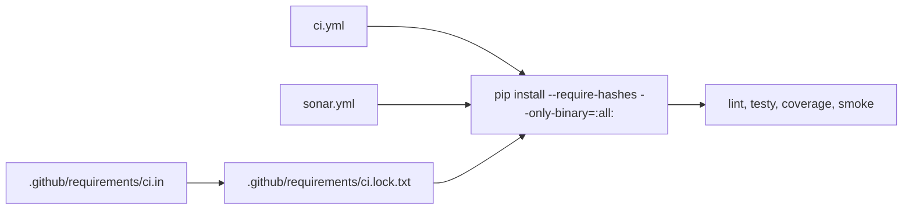

# Naprawa Ostrzeżeń Bezpieczeństwa Instalacji Zależności w GitHub Actions - Plan Implementacji

## Szczegóły Zadania

| Pole | Wartość |
| --- | --- |
| Tytuł | Naprawa ostrzeżeń bezpieczeństwa instalacji zależności w GitHub Actions |
| Opis | Workflow `.github/workflows/ci.yml` zgłasza diagnostyki `githubactions:S8544` i `githubactions:S8541` dla kroków `pip install`. Analiza repozytorium wykazała ten sam wzorzec w `.github/workflows/sonar.yml`: brak locka pełnego resolution, brak `--only-binary=:all:` i niepotrzebny self-upgrade `pip`. |
| Priorytet | Wysoki |
| Powiązany Research | Brak — analiza oparta na załączniku, istniejących workflowach repozytorium oraz oficjalnej dokumentacji `pip` i GitHub Actions |

## Proponowane Rozwiązanie

Wprowadzenie dedykowanego, wersjonowanego manifestu zależności dla linuxowego CI (`Python 3.11`), a następnie zastąpienie inline `pip install ...` w workflowach pojedynczym poleceniem instalującym z lock file z pełnymi wersjami, hashami i wymuszeniem kół binarnych. Lock file ma być generowany w Linuxie, aby odzwierciedlał rzeczywiste resolution Ubuntu dla `torch==2.5.1`, przy zachowaniu rozdzielenia od lokalnego profilu CUDA z `requirements.txt`.

## Uzasadnienie Rozwiązania

### Wybrane podejście

Wybrane podejście to osobny manifest top-level dla CI oraz wynikowy lock file używany równolegle przez `.github/workflows/ci.yml` i `.github/workflows/sonar.yml`. Jest to najmniejsza zmiana, która usuwa oba typy diagnostyk, nie miesza wymagań CI z lokalnym środowiskiem CUDA i nie wymaga rozbudowy architektury repozytorium.

### Porównanie z alternatywami

| Kryterium | Dedykowany lock file CI + wspólna instalacja | Inline pinning pakietów w YAML | Wykorzystanie istniejącego `requirements.txt` |
| --- | --- | --- | --- |
| Determinizm zależności transitively rozwiązywanych | ✅ Pełny | ⚠️ Częściowy | ❌ Niski |
| Bezpieczeństwo supply chain | ✅ Hash pinning + `--only-binary=:all:` | ⚠️ Nadal wysoki koszt utrzymania i ryzyko dryfu | ❌ Mieszanie profilu lokalnego i CI |
| Utrzymywalność | ✅ Jedno źródło prawdy dla CI | ❌ Duplikacja list pakietów w workflowach | ⚠️ Jeden plik, ale nie dla tego przypadku użycia |
| Dopasowanie do Linux CI na Ubuntu | ✅ Tak | ✅ Tak | ❌ Nie — lokalny plik zawiera wariant CUDA i pakiety niepotrzebne w CI |

### Dlaczego odrzucono alternatywy

- Inline pinning w YAML: usuwa część ostrzeżeń, ale pozostawia duplikację definicji zależności i utrudnia utrzymanie zgodności między `ci.yml` oraz `sonar.yml`.
- Wykorzystanie istniejącego `requirements.txt`: ten plik opisuje inne potrzeby niż workflowy CI, zawiera wariant CUDA `torch`, nie pełni roli lock file dla linuxowego joba Ubuntu i nadal nie zamraża w pełni transitive dependency graph.

## Rejestry Decyzji Architektonicznych (ADR)

Nie dotyczy — zadanie dotyczy lokalnego hardeningu workflowów i sposobu instalacji zależności, bez wprowadzania nowej architektury modułów lub integracji.

## Analiza Aktualnej Implementacji

### Już Zaimplementowane

Lista istniejących komponentów, funkcji i narzędzi, które zostaną ponownie użyte (wraz ze ścieżkami do plików):

- Workflow CI — `.github/workflows/ci.yml` — uruchamia `ruff`, testy jednostkowe z coverage, `compileall` oraz smoke testy CLI i środowiska.
- Workflow Sonar — `.github/workflows/sonar.yml` — uruchamia testy z coverage i skan SonarCloud z tym samym profilem linuxowego CI.
- Konfiguracja testów — `pyproject.toml` — zawiera repozytoryjną konfigurację `pytest`.
- Główny inwentarz zależności projektu — `requirements.txt` — pozwala ustalić wersje i zakres lokalnego stosu, ale nie jest bezpośrednio używalny jako lock file CI.

### Do Modyfikacji

Lista istniejącego kodu, który wymaga zmian lub rozszerzeń (wraz ze ścieżkami do plików i opisem zmian):

- `.github/workflows/ci.yml` — usunięcie ad-hoc `pip install`, usunięcie `python -m pip install --upgrade pip`, podmiana na instalację z lock file i dodanie lekkiej walidacji spójności środowiska.
- `.github/workflows/sonar.yml` — dopięcie do tego samego kontraktu instalacji zależności co `ci.yml`, aby nie utrzymywać dwóch rozchodzących się list pakietów.

### Do Utworzenia

Lista nowych komponentów, funkcji i narzędzi, które trzeba zbudować od podstaw:

- `.github/requirements/ci.in` — źródłowa lista top-level zależności potrzebnych wyłącznie dla linuxowego CI (`Python 3.11`).
- `.github/requirements/ci.lock.txt` — pełny lock file z dokładnymi wersjami i hashami używany przez workflowy.

## Otwarte Pytania

| # | Pytanie | Odpowiedź | Status |
| --- | --- | --- | --- |
| 1 | Czy można użyć istniejącego `requirements.txt` jako źródła instalacji dla CI? | Nie. Plik reprezentuje profil lokalnego środowiska treningowego, zawiera wariant CUDA `torch` i nie zamraża pełnego zestawu zależności potrzebnych przez joby Ubuntu. | ✅ Rozwiązane |
| 2 | Czy zakres powinien obejmować tylko `ci.yml`? | Nie. `sonar.yml` powiela ten sam wzorzec instalacji, więc bez jego synchronizacji problem wróci w innym workflowie i utrzymanie nadal będzie rozproszone. | ✅ Rozwiązane |
| 3 | Czy workflow musi nadal aktualizować `pip` przed instalacją? | Nie domyślnie. Dla tego zadania bezpieczniej usunąć self-upgrade i polegać na `pip` dostarczanym przez `actions/setup-python`, chyba że implementacja wykaże twardą potrzebę konkretnej wersji. | ✅ Rozwiązane |

## Plan Implementacji

### Faza 1: Ustabilizowanie źródła prawdy dla zależności CI

#### Zadanie 1.1 - [UTWÓRZ] Dodaj manifest top-level dla CI

**Opis**: Utwórz `.github/requirements/ci.in` jako jawne źródło prawdy dla zależności potrzebnych przez joby `lint-and-smoke` i `sonar`. Manifest ma opisywać wyłącznie minimalny zestaw top-level pakietów dla linuxowego CI, a wynikowy lock ma odzwierciedlać realne resolution Ubuntu.

**Definicja Ukończenia (Definition of Done)**:

- [x] `.github/requirements/ci.in` zawiera wyłącznie pakiety faktycznie używane przez `ci.yml` i `sonar.yml`.
- [x] Wszystkie top-level zależności w `ci.in` są przypięte do konkretnych wersji zgodnych z obecnym profilem CI (`torch`, `numpy`, `matplotlib`, `tensorboard`, `gymnasium`, `pandas`, `ruff`, `pytest`, `pytest-cov`).
- [x] Nagłówek pliku dokumentuje zakres: `Python 3.11`, Ubuntu, bez mieszania z lokalnym profilem CUDA z `requirements.txt`.

#### Zadanie 1.2 - [UTWÓRZ] Wygeneruj pełny lock file dla workflowów

**Opis**: Na podstawie `.github/requirements/ci.in` wygeneruj `.github/requirements/ci.lock.txt` z pełnym, deterministycznym resolution graph oraz hashami akceptowanymi przez `pip --require-hashes`.

**Definicja Ukończenia (Definition of Done)**:

- [x] `.github/requirements/ci.lock.txt` zawiera dokładne wersje wszystkich zależności transitywnych wymaganych przez profil CI.
- [x] Lock file zawiera `--hash=` dla wszystkich instalowanych artefaktów lub inną równoważną formę zgodną z `pip --require-hashes`.
- [x] Lock file daje się zainstalować poleceniem `python -m pip install --require-hashes --only-binary=:all: -r .github/requirements/ci.lock.txt`.
- [x] Sposób odświeżania lock file jest opisany w komentarzu nagłówkowym locka albo w sąsiednim artefakcie, bez przenoszenia list pakietów z powrotem do YAML workflowów.

### Faza 2: Podmiana instalacji w workflowach

#### Zadanie 2.1 - [MODYFIKUJ] Utwardź `.github/workflows/ci.yml`

**Opis**: Zastąp trzy obecne komendy instalacji `pip` jednym kontraktem opartym o lock file. Usuń self-upgrade `pip` i pozostaw bez zmian dalsze kroki `ruff`, `pytest`, `compileall` i smoke testy.

**Definicja Ukończenia (Definition of Done)**:

- [x] W `ci.yml` nie występuje już `python -m pip install --upgrade pip` bez jawnego pina wersji.
- [x] `ci.yml` instaluje zależności wyłącznie z `.github/requirements/ci.lock.txt` przy użyciu `--require-hashes` i `--only-binary=:all:`.
- [x] Kroki `ruff check`, `pytest`, `compileall`, smoke testy CLI i smoke test środowiska pozostają funkcjonalnie niezmienione.
- [x] Zmiana nie wprowadza alternatywnego indeksu pakietów ani założeń wymagających GPU.

#### Zadanie 2.2 - [MODYFIKUJ] Zsynchronizuj `.github/workflows/sonar.yml` z tym samym kontraktem instalacji

**Opis**: Zastosuj ten sam sposób instalacji zależności w `sonar.yml`, aby `coverage.xml` i skan SonarCloud korzystały z identycznego, zablokowanego zestawu pakietów co główny job CI.

**Definicja Ukończenia (Definition of Done)**:

- [x] `sonar.yml` używa tego samego lock file i tych samych flag instalacyjnych co `ci.yml`.
- [x] Krok `pytest tests/ --cov=... --cov-report=xml:coverage.xml -q` pozostaje bez zmian semantycznych.
- [x] W YAML workflowów nie pozostają już dwie niezależne listy wersji pakietów dla CI.

#### Zadanie 2.3 - [MODYFIKUJ] Dodaj lekką walidację spójności środowiska po instalacji

**Opis**: Po instalacji zależności dodaj nieinwazyjny krok typu `python -m pip check`, aby workflow kończył się wcześniej w przypadku rozjazdu lock file i rozwiązanego środowiska.

**Definicja Ukończenia (Definition of Done)**:

- [x] `ci.yml` uruchamia `python -m pip check` po instalacji zależności.
- [x] `sonar.yml` uruchamia `python -m pip check` po instalacji zależności.
- [x] Nowa walidacja nie wydłuża workflowów o długotrwałe kroki i nie dodaje zależności GPU.

### Faza 3: Regresja i domknięcie kontraktu jakościowego

#### Zadanie 3.1 - [UŻYJ PONOWNIE] Zweryfikuj istniejące joby na nowym kontrakcie zależności

**Opis**: Wykorzystaj już istniejące workflowy jako główną walidację regresji. Zmiana ma zostać potwierdzona przez udane wykonanie dotkniętych jobów i brak powrotu do dynamicznego instalowania pakietów.

**Definicja Ukończenia (Definition of Done)**:

- [x] Job `lint-and-smoke` przechodzi na Ubuntu z `Python 3.11` po zmianie sposobu instalacji zależności.
- [ ] Job `sonar` przechodzi w kontekście, w którym dostępne są wymagane sekrety (`SONAR_TOKEN`); jeśli walidacja odbywa się na forku lub bez sekretów, ograniczenie jest jawnie udokumentowane w PR.
- [x] Dla zmienionych linii workflowów nie są już raportowane diagnostyki `githubactions:S8544` i `githubactions:S8541`, albo ograniczenie walidacji jest jawnie opisane jako zależne od narzędzia/skanera.

**Uwaga implementacyjna**: Lokalnie zweryfikowano linuxowy odpowiednik joba `lint-and-smoke` w kontenerze `python:3.11`. Pełny krok `SonarCloud Scan` nie został uruchomiony lokalnie, mimo dostępnego `SONAR_TOKEN`, ponieważ workflow używa akcji GitHub wymagającej kontekstu runnera GitHub Actions.

**Uwaga dot. zakresu SonarCloud**: Repozytoryjna konfiguracja `sonar-project.properties` ogranicza analizę do `**/*.py`, więc `.github/workflows/**` i `.github/requirements/**` nie są walidowane przez job `sonar`. Dla tych plików kontrolą jakości pozostają diagnostyki workflowów (`get_errors`) oraz lokalna walidacja linuxowego odpowiednika joba `lint-and-smoke`.

## Aspekty Bezpieczeństwa

- Instalacja zależności musi używać pełnego lock file z hashami, aby zminimalizować ryzyko supply-chain drift i niekontrolowanej podmiany artefaktów.
- Workflowy muszą wymuszać `--only-binary=:all:`, aby nie wykonywać skryptów budujących pakiety ze źródeł podczas CI bez jawnej decyzji architektonicznej.
- Profil zależności CI musi pozostać odseparowany od lokalnego profilu GPU/CUDA, a lock file musi być generowany na Linuxie, aby odzwierciedlać rzeczywiste zależności joba Ubuntu.
- Jeżeli w przyszłości któryś pakiet nie będzie miał koła binarnego, wyjątek od `--only-binary=:all:` powinien być jawnie uzasadniony i ograniczony, a nie ukrywany przez usunięcie flagi z całego workflowa.

## Strategia Testowania

### Piramida testów

| Typ testu | Zakres | Szacowana liczba | Pokrycie |
| --- | --- | --- | --- |
| Jednostkowe | Nie dotyczy — zadanie modyfikuje workflowy i artefakty lockowania, nie logikę aplikacyjną | 0 | Nie dotyczy |
| Integracyjne | Job `lint-and-smoke` oraz job `sonar` z nowym kontraktem instalacji zależności | 2 | 100% zmienionych ścieżek workflowów i instalacji CI |
| E2E | Nie dotyczy — brak interfejsu użytkownika i ścieżek końcowego użytkownika | 0 | Nie dotyczy |

### Podejście do testowania

- [x] Regresyjne uruchomienie `lint-and-smoke` po przełączeniu na `.github/requirements/ci.lock.txt`
- [ ] Regresyjne uruchomienie `sonar` w kontekście z dostępnym `SONAR_TOKEN`
- [x] Weryfikacja `python -m pip check` oraz generacji `coverage.xml` po zmianie sposobu instalacji

### Testy wydajnościowe

Nie dotyczy — zadanie nie zmienia ścieżek SLA aplikacji ani kodu wykonującego przetwarzanie produkcyjne.

### Testy dostępności

Nie dotyczy — zadanie nie obejmuje UI.

### Testy architektoniczne

Nie dotyczy — zmiana nie wprowadza nowych granic modułów ani reguł zależności w kodzie aplikacyjnym.

### Testy mutacyjne

Nie dotyczy — zadanie nie obejmuje krytycznej logiki biznesowej ani algorytmów aplikacyjnych.

## Zapewnienie Jakości

Lista kontrolna kryteriów akceptacji do weryfikacji, że implementacja spełnia zdefiniowane wymagania:

- [x] Workflowy `ci.yml` i `sonar.yml` instalują zależności wyłącznie z committowanego lock file z hashami i `--only-binary=:all:`.
- [x] W repozytorium istnieje jedno źródło prawdy dla top-level zależności CI oraz jeden wynikowy lock file używany przez oba workflowy.
- [x] Zmiana zachowuje obecną semantykę lintu, testów, coverage i smoke testów bez dodawania zależności GPU ani budowania pakietów ze źródeł.

### Planowane quality gates z kontraktu `code-reviewing`

| Obszar | Planowana kontrola | Kryterium akceptacji |
| --- | --- | --- |
| Bezpieczeństwo | Weryfikacja diffu workflowów, kontraktu `pip install --require-hashes --only-binary=:all:`, `python -m pip check` oraz dostępnych diagnostyk/skanerów GitHub Actions; dla `.github/**` bez polegania na repozytoryjnym SonarCloud, bo jego zakres jest ograniczony do `**/*.py` | Dla zmienionych workflowów brak ad-hoc instalacji bez locka; `githubactions:S8544` i `githubactions:S8541` nie są zgłaszane dla nowych linii albo ograniczenie walidacji jest jawnie opisane jako zależne od narzędzia |
| Architektura i jakość | Review spójności między `.github/requirements/ci.in`, `.github/requirements/ci.lock.txt`, `ci.yml` i `sonar.yml` oraz izolacji od lokalnego `requirements.txt` | Jedno źródło prawdy dla CI subset, brak duplikacji list pakietów w YAML i brak mieszania profilu CI z profilem CUDA/local |
| Operacyjność | Uruchomienie `lint-and-smoke` oraz `sonar` na branchu lub w PR tego samego repozytorium | Joby przechodzą na Ubuntu/Python 3.11, `coverage.xml` nadal powstaje, a ograniczenia związane z sekretami Sonar są udokumentowane, jeśli uniemożliwiają pełną walidację |

## Usprawnienia (Poza Zakresem)

Potencjalne usprawnienia zidentyfikowane podczas planowania, które nie są częścią bieżącego zadania:

- Przypięcie używanych akcji GitHub (`actions/checkout`, `actions/setup-python`) do pełnych commit SHA zamiast samych tagów major.
- Dodanie automatycznego lintowania workflowów GitHub Actions (`actionlint` lub równoważny gate) dla wcześniejszego wykrywania problemów w YAML.

## Code Review Findings

### Przegląd 1 (2026-05-09)

- Status: gotowa warunkowo.
- Brak blokujących bugs i regresji w samym diffie po wdrożeniu lock file, aktualizacji workflowów i linuxowej walidacji `lint-and-smoke`.
- Otwarte ograniczenie walidacyjne: pełny krok `SonarCloud Scan` z `.github/workflows/sonar.yml` nie został wykonany lokalnie, bo wymaga kontekstu GitHub Actions; należy go domknąć na pushu lub PR z tego samego repozytorium.

### Przegląd 2 (2026-05-09 — pełny kontrakt weryfikacyjny)

**Wyniki testów i lintingu**: 194/194 testów przeszło (`pytest tests/`). Lint (`ruff check . --select E9,F63,F7,F82`) bez naruszeń.

**Naprawiony problem**: `.github/requirements/ci.in` brakowało znaku nowej linii na końcu pliku (ostatni bajt: ASCII 48 `'0'`). Poprawiono — plik teraz kończy się `\n`.

**Status wspólnego kontraktu weryfikacyjnego**:

| Obszar | Status | Uzasadnienie |
| --- | --- | --- |
| OWASP Top 10 | Sprawdzone | A06 (Vulnerable Components) zaadresowane przez hash pinning i `--only-binary=:all:`; brak wstrzykiwania (shell), brak hardkodowanych sekretów (SONAR_TOKEN przez GitHub Secrets) |
| Clean Architecture | Nie dotyczy | Brak zmian w kodzie aplikacyjnym |
| Secure by Design | Sprawdzone | `--require-hashes` + `--only-binary=:all:` + `pip check`; brak alternatywnych indeksów pakietów |
| Najlepsze praktyki Python | Sprawdzone | Poprawne flagi pip; `cache-dependency-path` ustawiony na lock file; izolacja profilu CI od lokalnego CUDA/requirements.txt |
| KISS i SOLID | Sprawdzone | Minimalna zmiana, DRY (jeden lock file dla obu workflowów), brak nadmiernej abstrakcji |
| Performance | Sprawdzone | Cache pip kluczowany na `ci.lock.txt`; brak wpływu na czas wykonania aplikacji |
| Reliability | Sprawdzone | `pip check` + deterministyczny resolution graph; wczesne wykrywanie konfliktów |
| Martwy i zbędny kod | Nie dotyczy | Brak martwego kodu wprowadzonego |
| Zero Trust dla danych zewnętrznych | Sprawdzone | Wszystkie zewnętrzne artefakty pakietów pokryte hashami SHA256 |
| Security scanning | Wymaga narzędzia/danych | `sonar-project.properties` ogranicza zakres skanowania do `**/*.py` — pliki `.github/**` nie są skanowane przez SonarCloud CI; `get_errors` dla `ci.yml` i `sonar.yml`: 0 problemów |

**Otwarte ograniczenia (przeniesione)**:

- `[ ] Job sonar` w GitHub Actions z SONAR_TOKEN — wymaga pushu/PR.
- Poza zakresem: `actions/checkout@v4` i `actions/setup-python@v5` nie są przypięte do pełnych commit SHA.

**Ogólna ocena**: Implementacja jest poprawna i gotowa do scalenia po domknięciu walidacji job `sonar` w GitHub Actions.

## Changelog

| Data | Opis Zmiany |
| --- | --- |
| 2026-05-09 | Wykonano pełny code review (kontrakt weryfikacyjny): 194/194 testów OK, lint czysty, naprawiono brak końcowej nowej linii w `ci.in`; ogólna ocena gotowa warunkowo (oczekuje walidacji job `sonar` w GH Actions) |
| 2026-05-09 23:32:30 | Wykonano code review agentem `code-reviewer`; brak blokujących ustaleń w diffie, pozostała warunkowa walidacja joba `sonar` w GitHub Actions |
| 2026-05-09 23:09:51 | Doprecyzowano kontrakt odświeżania `ci.lock.txt` na Linuxie i zapisano ograniczenie walidacji SonarCloud dla `.github/**` |
| 2026-05-09 23:09:51 | Po potwierdzeniu użytkownika skorygowano rozwiązanie: lock file ma być generowany w Linuxie i odzwierciedlać rzeczywiste zależności Ubuntu dla `torch==2.5.1`, zamiast zakładać profil `CPU-only` |
| 2026-05-09 | Utworzono wstępny plan naprawy ostrzeżeń bezpieczeństwa instalacji zależności w workflowach GitHub Actions |
