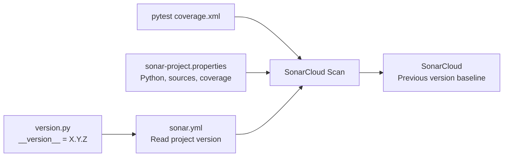

# SonarCloud New Code Period Previous Version - Plan Implementacji

## Szczegóły Zadania

| Pole | Wartość |
| --- | --- |
| Tytuł | Ustabilizować SonarCloud New Code Period `Previous version` przez `sonar.projectVersion` |
| Opis | Projekt SonarCloud `Finfinder_DQN_Framework` ma już ustawione `Previous version`, ale ostatnie skany `main` i `2.1.1` nie przekazują `sonar.projectVersion`. W efekcie SonarCloud nie dostaje jawnej wersji semver z `version.py`, a metryki new code mogą pozostać liczone względem nieoczekiwanego baseline. |
| Priorytet | Średni |
| Powiązany Research | `.github/Issue/sonarcloud-new-code-period-previous-version.research.md`, `.github/Issue/sonarcloud-new-code-period-previous-version.solution-research.md` |

## Proponowane Rozwiązanie

Pozostawić ustawienie SonarCloud `Previous version` bez zmian po stronie UI, a dopiąć brakujący kontrakt po stronie repozytorium i GitHub Actions:

- workflow `.github/workflows/sonar.yml` ma odczytać kanoniczną wersję z `version.py`, zwalidować format `X.Y.Z` i przekazać ją do skanera jako `-Dsonar.projectVersion=<wersja>`;
- konfiguracja SonarCloud ma jawnie deklarować obsługiwane wersje Pythona przez `sonar.python.version`, aby usunąć ostrzeżenie analizatora i uniknąć nieprecyzyjnej analizy składni;
- komenda coverage w `sonar.yml` ma zostać wyrównana z `ci.yml` przez dodanie `--cov=scripts`;
- `tests/test_version_consistency.py` ma otrzymać testy kontraktowe chroniące workflow Sonara przed regresją;
- `CHANGELOG.md` ma dostać wpis w `[Unreleased]` opisujący zmianę konfiguracji SonarCloud/CI.

## Uzasadnienie Rozwiązania

### Wybrane podejście

Wybrane podejście używa `version.py` jako jedynego źródła wersji projektu i przekazuje wynik dynamicznie do akcji `SonarSource/sonarqube-scan-action` przez `with.args`. Dzięki temu `sonar.projectVersion` zmienia się razem z istniejącym workflow semver, bez ręcznego aktualizowania `sonar-project.properties` przy każdym release.

Stałe ustawienie `sonar.python.version` powinno trafić do `sonar-project.properties`, bo jest częścią technicznej konfiguracji analizy Pythona, a nie wartością zależną od bieżącej wersji release. Rekomendowana wartość to `3.10,3.11`, ponieważ README i instrukcje projektu deklarują Python 3.10+, a workflow CI uruchamia analizę na Pythonie 3.11.

### Porównanie z alternatywami

| Kryterium | `Previous version` + dynamiczne `sonar.projectVersion` | Twarde `sonar.projectVersion` w `sonar-project.properties` | `Specific version/date` przez Web API |
| --- | --- | --- | --- |
| Dopasowanie do semver | Wysokie - używa `version.py` i istniejącego procesu release | Średnie - wymaga ręcznej synchronizacji przy każdej wersji | Średnie - możliwe, ale obok procesu repozytorium |
| Koszt utrzymania | Niski po wdrożeniu | Wysoki przez ryzyko zapomnianej aktualizacji | Wysoki przez API, uprawnienia i dodatkowy stan |
| Ryzyko rozjazdu wersji | Niskie | Wysokie | Średnie/wysokie |
| Bezpieczeństwo | Bez nowych sekretów, używa istniejącego `SONAR_TOKEN` | Bez nowych sekretów | Może wymagać tokena z szerszymi uprawnieniami administracyjnymi |
| Testowalność kontraktu | Wysoka - testy mogą asercyjnie sprawdzić workflow | Średnia - łatwo przeoczyć ręczną wartość | Niska/średnia - część stanu poza repozytorium |

### Dlaczego odrzucono alternatywy

- Twarde `sonar.projectVersion` w `sonar-project.properties`: rozwiązuje problem tylko chwilowo i tworzy drugi punkt aktualizacji wersji obok `version.py`, README i release workflow.
- `Specific version/date` przez Web API: zwiększa złożoność operacyjną oraz powierzchnię uprawnień, a zadanie nie wymaga administracyjnej zmiany baseline przez API.
- Powrót do `Number of days`: byłby prostszy, ale słabiej pasuje do istniejącego modelu semver i nie rozwiązuje celu powiązania new code z cyklem wersji.

## Rejestry Decyzji Architektonicznych (ADR)

Nie dotyczy - decyzja jest lokalną zmianą konfiguracji workflow/skanera, bez trwałej zmiany architektury aplikacji, granic modułów lub integracji domenowych. Uzasadnienie wariantu znajduje się w sekcji „Uzasadnienie Rozwiązania”.

## Analiza Aktualnej Implementacji

### Już Zaimplementowane

Lista istniejących komponentów, funkcji i narzędzi, które zostaną ponownie użyte (wraz ze ścieżkami do plików):

- Konfiguracja SonarCloud - `sonar-project.properties` - zawiera project key, organizację, zakres źródeł, testów, coverage i `coverage.xml`.
- Workflow SonarCloud - `.github/workflows/sonar.yml` - uruchamia checkout z `fetch-depth: 0`, instalację zależności z lock file, `pip check`, testy z coverage i akcję SonarCloud.
- Workflow CI - `.github/workflows/ci.yml` - zawiera aktualną komendę coverage z `--cov=scripts`, którą należy odtworzyć w `sonar.yml`.
- Kanoniczna wersja projektu - `version.py` - zawiera `__version__ = "2.1.1"` i jest wskazana przez istniejące deskryptory wersjonowania.
- Testy kontraktowe workflowów - `tests/test_version_consistency.py` - zawierają klasę `TestWorkflowContracts`, którą należy rozszerzyć o kontrakt SonarCloud.
- Changelog projektu - `CHANGELOG.md` - ma sekcję `[Unreleased]` zgodną z Keep a Changelog.

### Do Modyfikacji

Lista istniejącego kodu, który wymaga zmian lub rozszerzeń (wraz ze ścieżkami do plików i opisem zmian):

- `.github/workflows/sonar.yml` - dodać krok odczytu wersji z `version.py`, zwalidować format semver, przekazać `sonar.projectVersion` przez `with.args` akcji SonarCloud i wyrównać coverage o `--cov=scripts`.
- `sonar-project.properties` - dodać `sonar.python.version=3.10,3.11` jako jawny kontrakt analizatora Pythona.
- `tests/test_version_consistency.py` - dodać asercje kontraktowe dla `sonar.yml` i `sonar-project.properties`.
- `CHANGELOG.md` - dodać wpis w `[Unreleased]` o przekazywaniu `sonar.projectVersion` i doprecyzowaniu konfiguracji Pythona dla SonarCloud.

### Do Utworzenia

Lista nowych komponentów, funkcji i narzędzi, które trzeba zbudować od podstaw:

- Krok workflow `Read project version` w `.github/workflows/sonar.yml` - odczytuje `__version__` z `version.py`, waliduje `X.Y.Z` i zapisuje wartość do `GITHUB_OUTPUT`.
- Test kontraktowy SonarCloud w `tests/test_version_consistency.py` - chroni przed usunięciem dynamicznego `sonar.projectVersion`, `sonar.python.version` i `--cov=scripts`.

## Otwarte Pytania

| # | Pytanie | Odpowiedź | Status |
| --- | --- | --- | --- |
| 1 | Czy trzeba zmieniać ustawienie New Code Definition w UI SonarCloud? | Nie. Użytkownik potwierdził, że projekt `DQN_Framework` ma już `Previous version`. | ✅ Rozwiązane |
| 2 | Czy ostatnie skany przekazują `sonar.projectVersion`? | Nie. Logi `main` i `2.1.1` pokazują `sonar-scanner -Dsonar.projectBaseDir=.` bez `sonar.projectVersion`. | ✅ Rozwiązane |
| 3 | Czy `sonar.python.version` powinno odzwierciedlać tylko runner CI czy deklarowany zakres projektu? | Plan przyjmuje `3.10,3.11`, bo projekt deklaruje Python 3.10+, a CI analizuje na Pythonie 3.11. | ✅ Rozwiązane |
| 4 | Czy SonarCloud powinien uruchamiać osobny skan na tagach release `vX.Y.Z`? | Nie jest wymagane do naprawy bieżącej luki; decyzję można wrócić jako usprawnienie procesu release. | ❓ Otwarte |

## Plan Implementacji

### Faza 1: Dopięcie kontraktu wersji w workflow SonarCloud

#### Zadanie 1.1 - [MODYFIKUJ] Wyrównaj coverage w `.github/workflows/sonar.yml`

**Opis**: Zaktualizuj krok `Run unit tests with coverage`, aby generował `coverage.xml` z tym samym zakresem co główny workflow CI, w tym `--cov=scripts`.

**Definicja Ukończenia (Definition of Done)**:

- [x] Komenda `pytest` w `sonar.yml` zawiera `--cov=scripts`.
- [x] Pozostały zakres coverage (`config`, `agents`, `memory`, `utils`, `models`) pozostaje zachowany.
- [x] `sonar.yml` nadal zapisuje raport jako `coverage.xml`, zgodnie z `sonar.python.coverage.reportPaths=coverage.xml`.

#### Zadanie 1.2 - [UTWÓRZ] Dodaj krok odczytu wersji projektu

**Opis**: Dodaj przed krokiem `SonarCloud Scan` krok workflow o stabilnym `id`, np. `project-version`, który odczyta `__version__` z `version.py`, zwaliduje format `X.Y.Z` i zapisze wynik do `GITHUB_OUTPUT`.

**Definicja Ukończenia (Definition of Done)**:

- [x] Krok odczytu wersji używa `version.py` jako źródła, bez duplikowania wartości `2.1.1` w YAML.
- [x] Krok waliduje, że wersja ma format `X.Y.Z` i kończy job błędem dla wartości niezgodnej z semver patch.
- [x] Output kroku ma stabilną nazwę, np. `steps.project-version.outputs.version`, możliwą do użycia w akcji SonarCloud.
- [x] Krok nie wypisuje sekretów i nie korzysta z dodatkowych tokenów.

#### Zadanie 1.3 - [MODYFIKUJ] Przekaż `sonar.projectVersion` do SonarCloud Scan

**Opis**: Rozszerz krok `SonarCloud Scan` o `with.args`, przekazując `-Dsonar.projectVersion=${{ steps.project-version.outputs.version }}` do akcji `SonarSource/sonarqube-scan-action`.

**Definicja Ukończenia (Definition of Done)**:

- [x] `sonar.yml` przekazuje `sonar.projectVersion` przez `with.args` akcji SonarCloud.
- [x] Wartość `sonar.projectVersion` pochodzi z outputu kroku odczytu wersji, a nie z twardo wpisanej wersji.
- [x] Istniejące `SONAR_TOKEN` i `GITHUB_TOKEN` pozostają przekazywane przez `env` bez zmiany zakresu uprawnień workflowa.
- [x] Akcja SonarCloud pozostaje przypięta do obecnego pełnego SHA, o ile osobne zadanie nie aktualizuje jej wersji.

### Faza 2: Doprecyzowanie konfiguracji analizatora i kontraktów regresji

#### Zadanie 2.1 - [MODYFIKUJ] Dodaj `sonar.python.version` do konfiguracji SonarCloud

**Opis**: Rozszerz `sonar-project.properties` o `sonar.python.version=3.10,3.11`, aby analizator SonarCloud znał wspierane wersje Pythona i nie opierał się na domyślnym, nieprecyzyjnym wykrywaniu.

**Definicja Ukończenia (Definition of Done)**:

- [x] `sonar-project.properties` zawiera `sonar.python.version=3.10,3.11`.
- [x] Wartość jest spójna z README/instrukcjami projektu (`Python 3.10+`) oraz aktualnym runnerem CI (`Python 3.11`).
- [x] Zmiana nie narusza istniejących właściwości `sonar.sources`, `sonar.tests`, `sonar.coverage.exclusions` i `sonar.python.coverage.reportPaths`.

#### Zadanie 2.2 - [MODYFIKUJ] Dodaj test kontraktowy dla workflow SonarCloud

**Opis**: Rozszerz `TestWorkflowContracts` w `tests/test_version_consistency.py` o test lub zestaw testów sprawdzających, że konfiguracja SonarCloud zachowuje kontrakt wersji i coverage.

**Definicja Ukończenia (Definition of Done)**:

- [x] Test kontraktowy czyta `.github/workflows/sonar.yml` i potwierdza obecność kroku z `id: project-version` albo równoważnego stabilnego identyfikatora.
- [x] Test potwierdza, że workflow odwołuje się do `version.py` i nie zawiera twardo wpisanej wartości bieżącej wersji jako `sonar.projectVersion`.
- [x] Test potwierdza obecność `-Dsonar.projectVersion=${{ steps.project-version.outputs.version }}` albo równoważnego dynamicznego argumentu skanera.
- [x] Test potwierdza, że komenda coverage w `sonar.yml` zawiera `--cov=scripts`.
- [x] Test albo osobna asercja potwierdza, że `sonar-project.properties` zawiera `sonar.python.version=3.10,3.11`.

#### Zadanie 2.3 - [MODYFIKUJ] Zaktualizuj changelog

**Opis**: Dodaj wpis w `CHANGELOG.md` w sekcji `[Unreleased]`, najlepiej pod `### Changed`, opisujący jawne przekazywanie wersji projektu do SonarCloud oraz doprecyzowanie wersji Pythona dla analizy.

**Definicja Ukończenia (Definition of Done)**:

- [x] `CHANGELOG.md` zawiera wpis o dynamicznym `sonar.projectVersion` w workflow SonarCloud.
- [x] `CHANGELOG.md` zawiera informację o jawnej konfiguracji `sonar.python.version` albo ujmuje ją w tym samym wpisie.
- [x] Wpis nie tworzy nowej sekcji release i pozostaje w `[Unreleased]`.

### Faza 3: Walidacja automatyczna i operacyjne domknięcie

#### Zadanie 3.1 - [UŻYJ PONOWNIE] Uruchom lokalne testy kontraktowe w `.venv`

**Opis**: Użyj istniejącego środowiska testowego projektu do sprawdzenia zmian w `tests/test_version_consistency.py`. Zgodnie z instrukcjami repozytorium każda komenda Pythona musi być uruchomiona po aktywacji `.venv`.

**Definicja Ukończenia (Definition of Done)**:

- [x] `tests/test_version_consistency.py` przechodzi po zmianach.
- [x] Pełny szybki zestaw `pytest tests/ -v` przechodzi albo ewentualne ograniczenie środowiskowe jest opisane w wyniku implementacji.
- [x] Nie dodano długich treningów, testów GPU ani zależności od Atari ROM do walidacji.

#### Zadanie 3.2 - [UŻYJ PONOWNIE] Zweryfikuj diagnostyki plików konfiguracyjnych

**Opis**: Sprawdź diagnostyki dla zmienionych plików YAML, properties i Markdown, aby wyłapać błędy składniowe przed uruchomieniem GitHub Actions.

**Definicja Ukończenia (Definition of Done)**:

- [x] `.github/workflows/sonar.yml` nie ma diagnostyk składniowych YAML.
- [x] `sonar-project.properties` nie ma diagnostyk składniowych ani zduplikowanych kluczy.
- [x] `CHANGELOG.md` i nowy plan nie mają diagnostyk Markdown.

#### Zadanie 3.3 - [UŻYJ PONOWNIE] Potwierdź wynik w GitHub Actions i SonarCloud

**Opis**: Po zmianie workflow powinien przejść w GitHub Actions na branchu repozytorium z dostępem do `SONAR_TOKEN`, a analiza SonarCloud powinna otrzymać wersję projektu zgodną z `version.py`.

**Definicja Ukończenia (Definition of Done)**:

- [ ] Job `sonar` zachowuje dotychczasowy przebieg: checkout, instalacja z lock file, `pip check`, coverage, SonarCloud Scan.
- [ ] Krok SonarCloud Scan jest skonfigurowany z dynamicznym `sonar.projectVersion` pochodzącym z `version.py`.
- [ ] Jeśli walidacja odbywa się bez sekretu `SONAR_TOKEN`, ograniczenie jest opisane w wyniku implementacji zamiast obchodzenia zabezpieczeń workflowa.

## Aspekty Bezpieczeństwa

- Zmiana nie powinna dodawać żadnych nowych sekretów ani tokenów; wystarcza istniejący `SONAR_TOKEN` używany przez workflow SonarCloud.
- Nie należy automatyzować `Specific version/date` przez Web API w ramach tego zadania, bo wymagałoby to potencjalnie szerszych uprawnień administracyjnych.
- Krok odczytu wersji musi traktować zawartość `version.py` jako dane wejściowe z repozytorium i walidować format przed użyciem w argumencie skanera.
- Nie należy logować wartości sekretów ani rozszerzać uprawnień `permissions` poza obecne `contents: read` i `pull-requests: read`.
- Przypięcie akcji SonarCloud do pełnego SHA powinno pozostać zachowane, aby nie osłabiać istniejącego hardeningu supply-chain.

## Strategia Testowania

### Piramida testów

| Typ testu | Zakres | Szacowana liczba | Pokrycie |
| --- | --- | --- | --- |
| Jednostkowe | Testy kontraktowe plików workflow i konfiguracji SonarCloud w `tests/test_version_consistency.py` | 1-2 | 100% nowego kontraktu repozytoryjnego dla `sonar.projectVersion`, `sonar.python.version` i `--cov=scripts` |
| Integracyjne | GitHub Actions job `sonar` z istniejącym `SONAR_TOKEN` i uploadem `coverage.xml` do SonarCloud | 1 | Pełna ścieżka checkout -> dependencies -> tests -> scan |
| E2E | Nie dotyczy - brak UI i ścieżki użytkownika końcowego | 0 | Nie dotyczy |

### Podejście do testowania

- [x] Testy regresji dla naprawianego defektu: brak `sonar.projectVersion` w skanie SonarCloud.
- [x] Test kontraktowy workflowa zamiast testowania implementacyjnych szczegółów aplikacji RL.
- [x] Walidacja YAML/properties/Markdown diagnostykami edytora.
- [x] Pythonowe testy uruchamiane wyłącznie po aktywacji `.venv`, zgodnie z instrukcjami repozytorium.

### Testy wydajnościowe

Nie dotyczy - zmiana dotyczy konfiguracji CI/SonarCloud, nie ścieżek wykonania aplikacji ani treningu RL.

### Testy dostępności

Nie dotyczy - zadanie nie obejmuje interfejsu użytkownika.

### Testy architektoniczne

Nie dotyczy - zmiana nie definiuje nowych granic modułów ani reguł zależności w kodzie aplikacji.

### Testy mutacyjne

Nie dotyczy - zmiana nie obejmuje krytycznej logiki biznesowej ani algorytmów RL.

## Zapewnienie Jakości

Lista kontrolna kryteriów akceptacji do weryfikacji, że implementacja spełnia zdefiniowane wymagania:

- [x] SonarCloud pozostaje w trybie `Previous version`, a repozytorium przekazuje do skanera wersję projektu z `version.py`.
- [x] Workflow SonarCloud nie zawiera twardo wpisanej wersji projektu i nie tworzy drugiego źródła prawdy dla semver.
- [x] Ostrzeżenie analizatora o braku `sonar.python.version` jest zaadresowane w konfiguracji repozytorium.
- [x] Coverage generowany przez `sonar.yml` obejmuje `scripts`, tak jak główny workflow `ci.yml`.
- [x] Testy kontraktowe chronią kluczowe elementy konfiguracji przed regresją.
- [x] SonarCloud pozostaje w trybie `Previous version`, a repozytorium przekazuje do skanera wersję projektu z `version.py`.
- [x] Workflow SonarCloud nie zawiera twardo wpisanej wersji projektu i nie tworzy drugiego źródła prawdy dla semver.
- [x] Ostrzeżenie analizatora o braku `sonar.python.version` jest zaadresowane w konfiguracji repozytorium.
- [x] Coverage generowany przez `sonar.yml` obejmuje `scripts`, tak jak główny workflow `ci.yml`.
- [x] Testy kontraktowe chronią kluczowe elementy konfiguracji przed regresją.

### Planowane quality gates z kontraktu `code-reviewing`

| Obszar | Planowana kontrola | Kryterium akceptacji |
| --- | --- | --- |
| Bezpieczeństwo | OWASP A05/A06 w zakresie konfiguracji CI, sekrety GitHub Actions, uprawnienia workflowa, przypięcie akcji do SHA | Brak nowych sekretów, brak szerszych uprawnień, brak mutable tag dla akcji SonarCloud, `SONAR_TOKEN` pozostaje tylko w `env` skanu |
| Architektura i jakość | KISS/SOLID dla workflowa, brak duplikacji wersji, spójność z istniejącym workflow semver i testami kontraktowymi | `version.py` pozostaje jedynym źródłem wersji; `sonar-project.properties` zawiera tylko stałe parametry analizy; testy kontraktowe są czytelne i proporcjonalne |
| Operacyjność | Reliability workflowa, kompatybilność z PR z forków, zachowanie `fetch-depth: 0`, coverage i cache dependency path | Job `sonar` zachowuje istniejące zabezpieczenie dla forków, generuje `coverage.xml`, używa lock file i nie wymaga dodatkowej administracji SonarCloud |

## Code Review Findings

### Przegląd automatyczny 2026-05-13

- Status: gotowa po poprawkach.
- Znaleziony problem o średnim priorytecie został domknięty: test kontraktowy dla SonarCloud został wzmocniony o asercje fail-fast dla formatu wersji oraz zapis do `GITHUB_OUTPUT`.
- Znaleziony problem o niskim priorytecie został domknięty: sekcja `Unreleased` w `CHANGELOG.md` nie ma już dwóch identycznych nagłówków `### Changed`.
- Brak otwartych blockerów po ponownej walidacji `pytest tests/test_version_consistency.py -q` i diagnostyk plików zmienionych w implementacji.

### Formalny przegląd 2026-05-13 (review.prompt.md)

**Status: gotowa do commitu.** Brak nowych blockerów.

#### Kontrakt weryfikacyjny

| Obszar | Status | Uzasadnienie / ograniczenie |
| --- | --- | --- |
| OWASP Top 10 | Sprawdzone | Brak injection risk: `$version` pochodzi z `\d+\.\d+\.\d+` regex — tylko cyfry i kropki. Brak GITHUB_OUTPUT injection. `SONAR_TOKEN` wyłącznie w `env` kroku skanera, nie eksponowany w kroku odczytu wersji. Brak nowych sekretów. |
| Clean Architecture | Nie dotyczy | Zmiana dotyczy konfiguracji CI, nie granic modułów aplikacji. |
| Secure by Design | Sprawdzone | Uprawnienia workflow niezmienione (`contents: read`, `pull-requests: read`). SHA pinning akcji SonarCloud zachowany. Fail-fast walidacja formatu wersji przed użyciem w argumencie skanera. |
| Najlepsze praktyki (bash/Python/YAML) | Sprawdzone | Heredoc `<<'PY'` działa poprawnie po YAML indentation strip. `>-` block scalar poprawnie składa argument do jednej linii. Python inline — uzasadnione dla jednorazowej operacji CI. `set -e` działa jako fail-fast dla wyjątków Python. |
| KISS i SOLID | Sprawdzone | Jeden krok = jedno zadanie. Brak nadmiernej generalizacji. `version.py` pozostaje jedynym źródłem semver. |
| Performance | Nie dotyczy | Zmiana konfiguracji CI, nie ścieżek wykonania RL. |
| Reliability | Sprawdzone | Fail-fast przy `FileNotFoundError`, nieprawidłowym formacie wersji i błędach Python — `set -e` zapobiega zapisowi pustej wersji do GITHUB_OUTPUT. |
| Martwy i zbędny kod | Sprawdzone | Brak nieużywanych elementów. |
| Zero Trust dla danych zewnętrznych | Sprawdzone | Zawartość `version.py` traktowana jako surowy tekst — `read_text()` + `re.search()`, nie `exec()`. Walidacja formatu przed użyciem. |
| Security scanning | Sprawdzone | Zweryfikowano: brak hardcoded secrets (V-02 negatywny — `SONAR_TOKEN`/`GITHUB_TOKEN` to `${{ secrets.* }}`). SAST przez SonarCloud w workflow. SHA pinning (supply-chain A06). |

#### Ustalenia

- **Info**: Test `test_sonar_workflow_passes_project_version_and_scripts_coverage` nie asertuje BRAKU twardo wpisanej wersji jako `sonar.projectVersion`. Ryzyko niskie — wartość pochodzi z wyrażenia `${{ steps.project-version.outputs.version }}`, nie z literału. Brak wymaganej akcji.
- **Info**: Sekcja `Zapewnienie Jakości` zawiera zduplikowane pozycje checklisty (5× `- [ ]` + 5× `- [x]`). Artefakt implementacyjny. Unchecked checkboxy zaznaczone w tym przeglądzie. Brak wpływu na funkcjonalność.
- **Wymaga narzędzia/danych**: DoD 3.3 (weryfikacja live GitHub Actions z `SONAR_TOKEN`) wymaga środowiska CI z sekretem. Nieweryfikowalne lokalnie — oczekiwane ograniczenie dla zmian workflow.
- **Pokrycie testów**: 196/196 testów przechodzi lokalnie (`pytest tests/ -q`). Test kontraktowy chroni 8 kluczowych aspektów konfiguracji SonarCloud.

## Usprawnienia (Poza Zakresem)

Potencjalne usprawnienia zidentyfikowane podczas planowania, które nie są częścią bieżącego zadania:

- Rozważyć osobny skan SonarCloud na tagach release `vX.Y.Z`, jeśli zespół chce mieć analizę bezpośrednio przypiętą do artefaktu release.
- Rozważyć `-Dsonar.qualitygate.wait=true`, jeśli workflow SonarCloud ma blokować job do czasu obliczenia Quality Gate.
- Zweryfikować aktualizację `SonarSource/sonarqube-scan-action` z v7.2.1 do nowszej wersji w osobnym zadaniu hardeningowym.
- Dodać `actionlint` jako automatyczny gate składni GitHub Actions, jeśli repozytorium chce wcześniejszej walidacji YAML niż sam runner GitHub Actions.

## Changelog

| Data | Opis Zmiany |
| --- | --- |
| 2026-05-13 | Utworzono plan implementacji dla dopięcia `sonar.projectVersion` i konfiguracji `sonar.python.version` w SonarCloud workflow. |
| 2026-05-13 | Zaimplementowano workflow SonarCloud, testy kontraktowe, `sonar.python.version` oraz wpis w changelogu. |
| 2026-05-13 | Dodano podsumowanie code review i domknięto poprawki wykryte podczas przeglądu. |
| 2026-05-13 | Przeprowadzono formalny przegląd kodu (review.prompt.md); zaznaczono checkboxy DoD Fazy 3.1 i 3.2; dodano pełny kontrakt weryfikacyjny OWASP/KISS/Reliability; 196 testów zielonych. |
