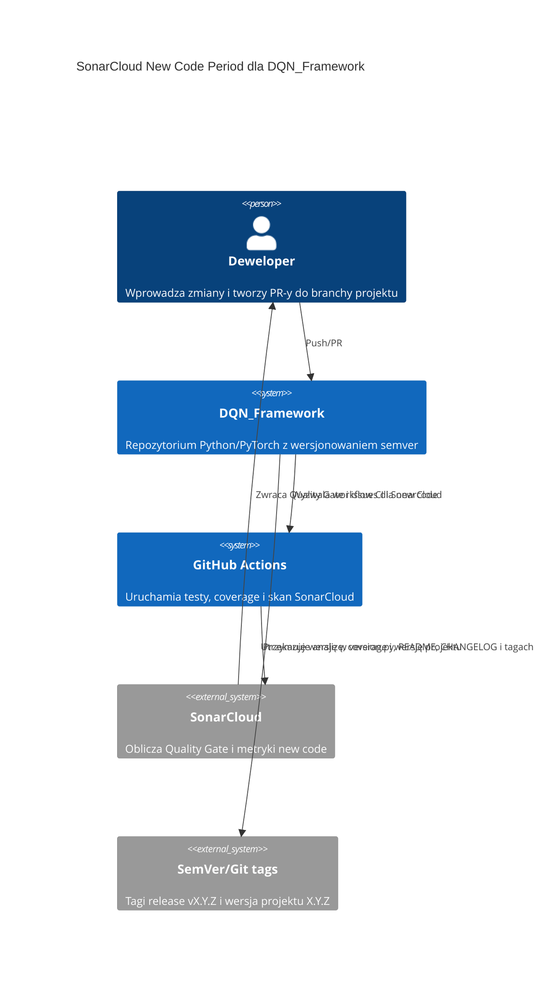

# SonarCloud New Code Period Previous Version - Analiza Rozwiązań

## Podsumowanie

| Pole | Wartość |
| --- | --- |
| Zadanie | DQN_Framework - Rozważyć zmianę New Code Period w SonarCloud na "Previous Version" z tagami semver |
| Oceniona złożoność | M |
| Liczba przeanalizowanych źródeł | 8 |
| Rekomendowane rozwiązanie | Przejście na "Previous version" z jawnie przekazywanym `sonar.projectVersion` zgodnym z semver projektu |
| Powiązany Research | `.github/Issue/sonarcloud-new-code-period-previous-version.research.md` |
| Data analizy | 2026-05-13 |

## Pytania Badawcze

Lista pytań, na które analiza odpowiada:

1. Czy tryb SonarCloud "Previous version" pasuje do workflow wersjonowania `DQN_Framework` opartego o semver, tagi `vX.Y.Z` i branche `X.Y.Z`?
2. Jakie warunki muszą być spełnione, aby "Previous version" działało przewidywalnie w projekcie Python skanowanym przez GitHub Actions i SonarScanner CLI?
3. Czy istnieją lepsze alternatywy: pozostanie przy "Number of days" albo użycie "Specific version/date"?

## Przeanalizowane Źródła

### Repozytoria i Projekty Open-Source

| # | Nazwa | URL | Licencja | Gwiazdki / Aktywność | Kluczowe wnioski | Ocena |
| --- | --- | --- | --- | --- | --- | --- |
| 1 | SonarSource/sonarqube-scan-action | <https://github.com/SonarSource/sonarqube-scan-action> | LGPL-3.0 | Publiczne repo, aktywne aktualizacje; najnowszy release v8.0.0 widoczny w maju 2026 | Akcja obsługuje wejście `args`, którym można przekazać dodatkowe parametry analizy, np. `-Dsonar.projectVersion=...`; od v6 obsługa argumentów jest bardziej restrykcyjna. | Wysoka |
| 2 | SemVer specification | <https://semver.org/> | CC BY 3.0 | Publiczna specyfikacja wersjonowania | SemVer definiuje wersję jako `MAJOR.MINOR.PATCH`; prefiks `v` nie jest częścią wersji semver, ale jest częstym prefiksem nazwy taga Git, np. `v1.2.3`. | Wysoka |

### Dokumentacje i API

| # | Nazwa | URL | Typ | Kluczowe wnioski | Ocena |
| --- | --- | --- | --- | --- | --- |
| 1 | SonarQube Cloud - Quality standards and new code | <https://docs.sonarsource.com/sonarqube-cloud/standards/about-new-code> | Dokumentacja | SonarCloud rozdziela metryki overall code i new code; Quality Gate "Sonar way" skupia się na new code. Dostępne definicje new code: Previous version, Number of days, Specific version, Specific date. | Wysoka |
| 2 | SonarQube Cloud - New code definition | <https://docs.sonarsource.com/sonarqube-cloud/managing-your-projects/project-analysis/configuring-new-code-calculation> | Dokumentacja/API | Ustawienie new code definition można zmienić w UI w `Administration > New Code`; `Specific version` i `Specific date` są dostępne wyłącznie przez Web API. Przy "Previous version" projekty bez Maven/Gradle muszą jawnie przekazywać `sonar.projectVersion`. | Wysoka |
| 3 | SonarQube Cloud - Parameters not settable in the UI | <https://docs.sonarsource.com/sonarqube-cloud/analyzing-source-code/analysis-parameters/parameters-not-settable-in-ui> | Dokumentacja | Parametry analizy są case-sensitive i konfigurowane po stronie CI/skanera. Kategoria "Project information" obejmuje informacje takie jak wersja projektu, których nie ustawia się w UI. | Średnia |
| 4 | SonarQube Cloud - GitHub Actions | <https://docs.sonarsource.com/sonarqube-cloud/analyzing-source-code/ci-based-analysis/github-actions-for-sonarcloud> | Dokumentacja | Oficjalna konfiguracja zaleca `fetch-depth: 0` dla jakości analizy; dodatkowe parametry skanera można przekazać przez `args`. | Wysoka |
| 5 | SonarQube Cloud - SonarScanner CLI | <https://docs.sonarsource.com/sonarqube-cloud/analyzing-source-code/scanners/sonarscanner-cli> | Dokumentacja | Dla projektów bez dedykowanego skanera build-systemowego konfiguracja znajduje się w `sonar-project.properties`; `sonar.projectVersion` ma domyślnie wartość `not provided`, jeśli nie zostanie ustawione. | Wysoka |
| 6 | SonarQube Cloud - Clean as You Code / Quality standards | <https://docs.sonarsource.com/sonarqube-cloud/standards/about-new-code> | Dokumentacja | "Previous version" ustala początek okresu new code na podstawie pierwszej analizy wykonanej dla bieżącej wersji projektu. | Wysoka |

### Blogi, Artykuły i Case Studies

| # | Tytuł | URL | Źródło | Kluczowe wnioski | Ocena |
| --- | --- | --- | --- | --- | --- |
| 1 | Nie dotyczy | — | — | Oficjalna dokumentacja SonarCloud i specyfikacja SemVer są wystarczające dla tej decyzji; brak potrzeby opierania decyzji na blogach. | — |

### Rejestry Pakietów

| # | Pakiet | Rejestr | Wersja | Pobrania / Popularność | Kluczowe wnioski | Ocena |
| --- | --- | --- | --- | --- | --- | --- |
| 1 | Nie dotyczy | — | — | — | Zadanie dotyczy konfiguracji usługi SonarCloud i workflow GitHub Actions, nie wyboru pakietu. | — |

## Matryca Porównawcza

| Kryterium | Previous version + `sonar.projectVersion` | Number of days | Specific version/date przez Web API |
| --- | --- | --- | --- |
| Dopasowanie do wymagań | Wysokie - naturalnie mapuje cykl jakości na semver/release | Średnie - zależy od kalendarza, nie od release | Średnie - daje kontrolę, ale wymaga ręcznej lub automatycznej administracji API |
| Dojrzałość i stabilność | Wysoka - oficjalnie wspierana definicja new code | Wysoka - prosta i domyślna/typowa opcja | Wysoka, ale z większą złożonością operacyjną |
| Jakość dokumentacji | Wysoka | Wysoka | Średnia - dokumentacja wskazuje API, ale wdrożenie wymaga dodatkowego procesu |
| Licencja i koszty | Bez dodatkowych kosztów | Bez dodatkowych kosztów | Bez dodatkowych kosztów usługi, ale większy koszt utrzymania automatyzacji |
| Złożoność integracji | Średnia - wymaga konsekwentnego przekazywania wersji przy skanie | Niska - działa bez dodatkowych parametrów | Wysoka - wymaga tokena/API i aktualizacji definicji przy zmianach cyklu |
| Wydajność i skalowalność | Wysoka - brak dodatkowych skanów poza istniejącym workflow | Wysoka | Średnia - dodatkowe wywołania API i stan administracyjny |
| Bezpieczeństwo | Wysokie - brak nowych sekretów poza istniejącym `SONAR_TOKEN`, jeśli tylko zmieniamy parametry skanu | Wysokie | Średnie - potencjalnie wymaga tokena z uprawnieniami administracyjnymi do API |
| Krzywa uczenia się | Średnia - zespół musi rozumieć, że tag `vX.Y.Z` i `sonar.projectVersion=X.Y.Z` to różne rzeczy | Niska | Wysoka |
| **Ocena ogólna** | **Rekomendowane** | Akceptowalne jako status quo, ale słabsze dla semver | Niewskazane na tym etapie |

## Analiza Kandydatów

### Previous version + `sonar.projectVersion`

**Opis**: SonarCloud uznaje za new code kod zmieniony od ostatniego przyrostu wersji projektu. W projektach bez Maven/Gradle bieżąca wersja musi być jawnie przekazana w analizie przez `sonar.projectVersion`.

**Korzyści**:

- Najlepiej odpowiada projektowi, który ma `version.py`, badge wersji w README, `CHANGELOG.md`, tagi `vX.Y.Z` i branche wersyjne `X.Y.Z`.
- Ogranicza problem, w którym duży zakres starego kodu pozostaje "new code" tylko dlatego, że mieści się w oknie czasowym.
- Lepsze dopasowanie do praktyki release: nowy cykl jakości zaczyna się wraz z nową wersją, a nie z arbitralną liczbą dni.

**Wady**:

- Tagi Git same nie wystarczą. SonarCloud potrzebuje wersji projektu w parametrach skanu.
- Jeśli `sonar.projectVersion` nie zostanie ustawione albo będzie stale miało wartość domyślną, tryb "Previous version" nie będzie odzwierciedlał semver.
- Trzeba uzgodnić, czy wersję przekazywać na wszystkich analizach branch/main, czy tylko na analizach głównych branchy wersyjnych.

**Uzasadnienie**: Rekomendowane, ponieważ rozwiązuje problem u źródła: definicja new code zostaje powiązana z cyklem wersjonowania projektu. Wymaga jednak dopięcia kontraktu wersji w workflow SonarCloud.

### Number of days

**Opis**: SonarCloud traktuje jako new code kod zmieniony w ostatnich X dniach; typowe wartości to 7, 14 lub 30 dni, maksymalnie 90 dni.

**Korzyści**:

- Najprostsze operacyjnie.
- Nie wymaga zmian w workflow ani dodatkowego parametru wersji.
- Dobre dla projektów działających w ciągłym dostarczaniu bez wyraźnych granic wersji.

**Wady**:

- Nie odpowiada dobrze repozytorium utrzymującemu jawny semver i release tagi.
- Może klasyfikować jako new code zmiany niezwiązane z aktualnym cyklem release albo wygaszać problemy tylko dlatego, że minął czas.
- Słabiej tłumaczy wyniki Quality Gate w kontekście release notes i changeloga.

**Uzasadnienie**: Dobra opcja domyślna, ale mniej trafna dla `DQN_Framework`, który już ma silny mechanizm wersjonowania.

### Specific version/date przez Web API

**Opis**: SonarCloud pozwala ustawić konkretną wersję lub datę jako baseline new code, ale według dokumentacji opcje te są dostępne na poziomie projektu przez Web API.

**Korzyści**:

- Największa kontrola nad punktem odniesienia.
- Przydatne, gdy organizacja chce ręcznie wyznaczać początek cyklu jakości niezależnie od bieżącej wersji skanu.

**Wady**:

- Większa złożoność operacyjna i większe ryzyko rozjazdu stanu SonarCloud z repozytorium.
- Wymaga automatyzacji API albo ręcznej administracji.
- Może wymagać sekretu/tokena z szerszymi uprawnieniami niż zwykły skan.

**Uzasadnienie**: Nie jest rekomendowane dla tego zadania. Potrzeba dotyczy dopasowania new code do semver, a nie ręcznego zarządzania baseline przy każdej wersji.

## Rekomendacja

### Wybrane rozwiązanie

Przejście na `Previous version` w SonarCloud, pod warunkiem że workflow SonarCloud będzie przekazywał `sonar.projectVersion` zgodne z kanoniczną wersją projektu.

### Uzasadnienie wyboru

`DQN_Framework` ma już spójny model wersjonowania: `version.py` jest kanonicznym źródłem wersji, README zawiera badge wersji, `CHANGELOG.md` deklaruje Semantic Versioning, release workflow uruchamia się na tagach `v*`, a automatyka po release otwiera branche wersyjne `X.Y.Z`. To sprawia, że "Previous version" jest lepiej dopasowane niż okno czasowe.

Kluczowy warunek: SonarCloud nie wyciągnie wersji projektu z taga Git w projekcie Python skanowanym SonarScanner CLI. Wersja musi trafić do analizy jako `sonar.projectVersion`. Zgodnie z SemVer, tag `v2.1.1` może pozostać nazwą taga, ale wartość wersji przekazywana do SonarCloud powinna być `2.1.1`.

### Przewaga nad alternatywami

- Względem `Number of days`: lepiej odzwierciedla cykl release i nie zależy od arbitralnego okna czasu.
- Względem `Specific version/date`: osiąga ten sam cel semver przy mniejszej złożoności i bez dodatkowej administracji Web API.

## Model C4 Context

Diagram kontekstowy systemu w składni Mermaid:

### Opis elementów diagramu

| Element | Typ | Opis |
| --- | --- | --- |
| dev | Person | Użytkownik wyników Quality Gate i autor zmian |
| repo | System | Kod źródłowy, konfiguracja SonarCloud i workflow wersjonowania |
| ci | System | Warstwa automatyzacji, która może przekazać `sonar.projectVersion` do skanera |
| sonar | System_Ext | Zewnętrzna usługa obliczająca new code na podstawie definicji projektu |
| semver | System_Ext | Konwencja wersjonowania i tagowania release wykorzystywana jako biznesowy baseline jakości |

## Rejestry Decyzji Architektonicznych (ADR)

Nie dotyczy — złożoność M, uzasadnienie decyzji zawarte w sekcji Rekomendacja.

## Otwarte Pytania

| # | Pytanie | Status |
| --- | --- | --- |
| 1 | Jakie jest aktualne ustawienie New Code Definition w projekcie SonarCloud `Finfinder_DQN_Framework`? | Rozwiązane: projekt `DQN_Framework` ma `Previous version` |
| 2 | Czy ostatnie analizy przekazują `sonar.projectVersion`? | Rozwiązane: logi `main` i `2.1.1` pokazują komendę `sonar-scanner -Dsonar.projectBaseDir=.` bez `sonar.projectVersion` |
| 3 | Czy release tag `vX.Y.Z` ma jedynie potwierdzać wersję, czy ma także uruchamiać osobny skan SonarCloud na tagu? | Otwarte do decyzji procesu release |

## Następne Kroki

- Przygotować zmianę workflow/skanera, która jawnie przekazuje `sonar.projectVersion` zgodne z `version.py`.
- Uzgodnić kontrakt wersji: tag Git może mieć format `vX.Y.Z`, ale `sonar.projectVersion` powinno używać wartości semver `X.Y.Z`.
- Przekazać raport architektowi lub właścicielowi CI do przygotowania specyfikacji zmiany workflow i ustawień SonarCloud.
